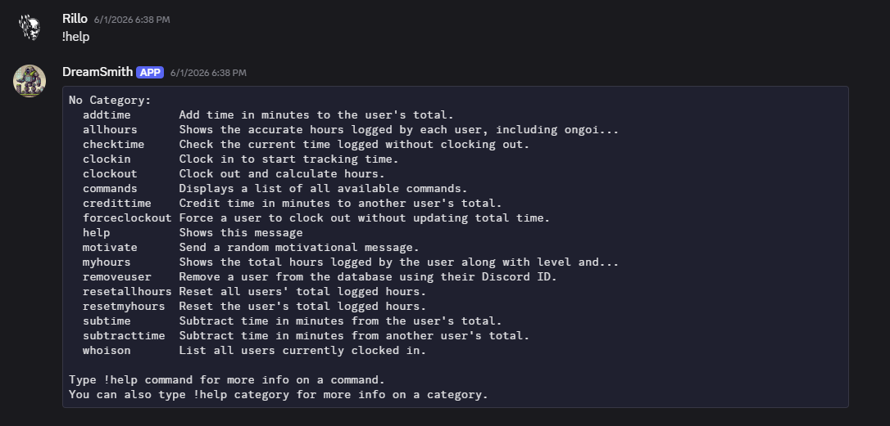
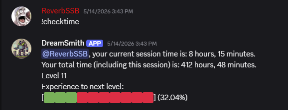
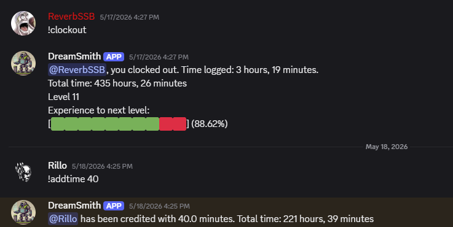
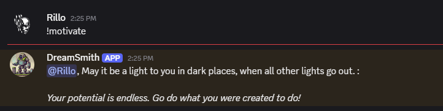
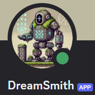

# Dreamsmith Productivity Bot

A gamified productivity tracking system built with Python, Discord, PostgreSQL, and Heroku.

The Dreamsmith Productivity Bot transforms productive work into measurable progress through a persistent leveling system inspired by role-playing games.

Users clock in, work on meaningful goals, clock out, and accumulate experience over time. Progress is tracked through levels, milestones, progression messages, and long-term statistics.

> Meaningful work compounds.

---

## Why I Built It

Most productivity tools focus on schedules, reminders, and task lists.

The Dreamsmith Productivity Bot focuses on something different:

**Consistency.**

The goal is to reward sustained effort over long periods of time and make progress visible in the same way role-playing games make character progression visible.

---

## Features

### Command System

The bot includes commands for:

* Clocking In
* Clocking Out
* Session Tracking
* Progress Monitoring
* Motivation
* Administrative Controls
* User Management

---

### Progress Tracking

Users can track active sessions, total accumulated hours, current level, and progress toward the next milestone.

---

### Leveling System

Productive work is converted into experience points and persistent progression levels.

As users accumulate hours, they unlock new levels and progression messages.

---

### Motivation System

The bot contains motivational messages designed to reinforce long-term growth and consistency.

---

### Bot Identity

Dreamsmith was designed to feel less like a utility and more like a persistent companion focused on growth and progress.

---

## Technical Highlights

### Backend Architecture

* Python
* Discord.py
* PostgreSQL
* Psycopg2
* Heroku Deployment

### Database Features

* Persistent User Profiles
* Total Hours Tracking
* Clock-In State Tracking
* Level Persistence
* Administrative Controls

### Progression Systems

* Experience-Based Advancement
* Persistent Levels
* Progress Bars
* Milestone Messages
* Long-Term Progress Tracking

---

## Philosophy

The Dreamsmith Productivity Bot was built around a simple belief:

Small amounts of meaningful work, performed consistently over time, can transform a person's life.

Rather than focusing on short-term motivation, the system emphasizes long-term progression and personal development.

---

## Dreamsmith Studios

The Dreamsmith Productivity Bot is one of several projects being developed under Dreamsmith Studios.

Current projects include:

* Productivia
* Dustrunner
* Dreamsmith Productivity Bot

All Dreamsmith projects are built around systems, progression, growth, and long-term achievement.
